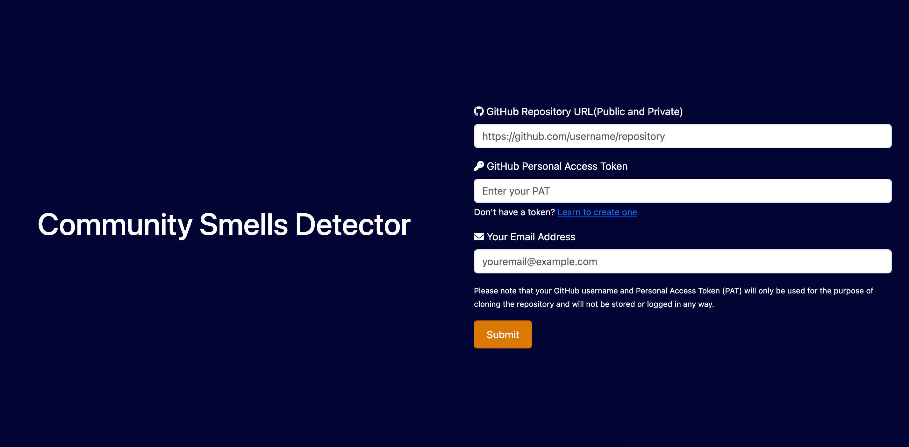
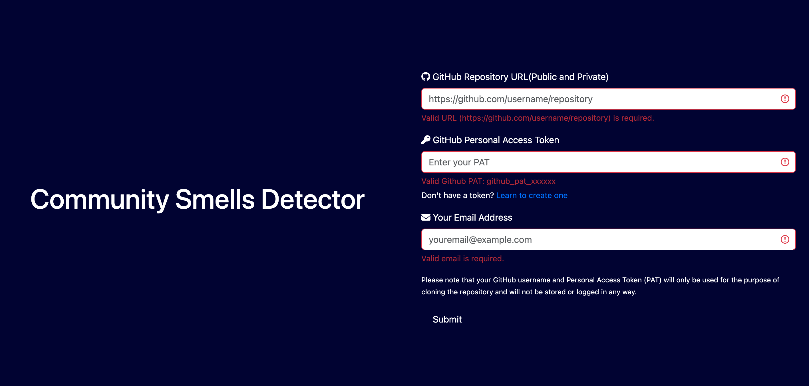
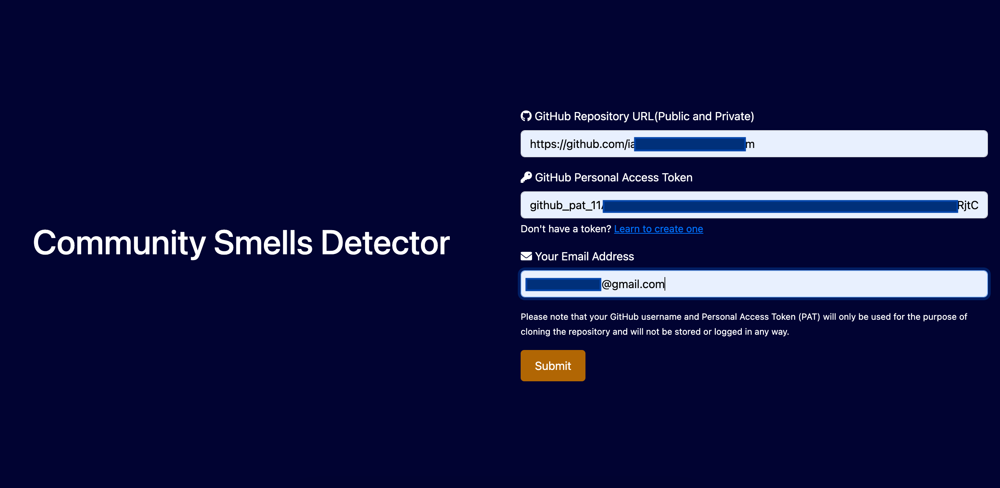
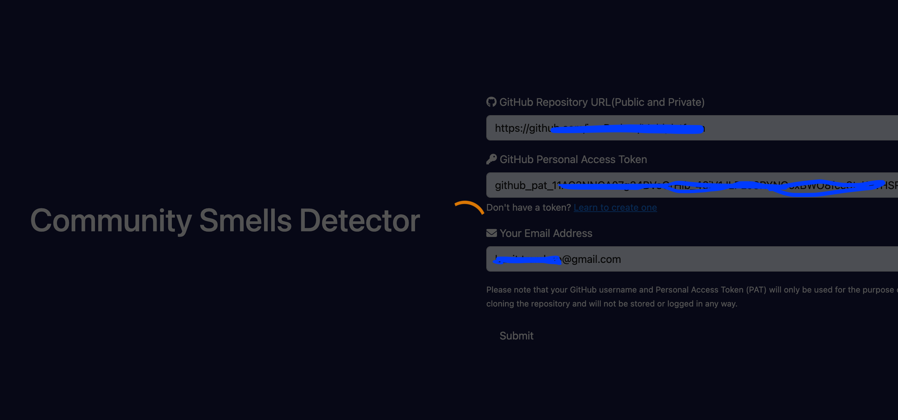
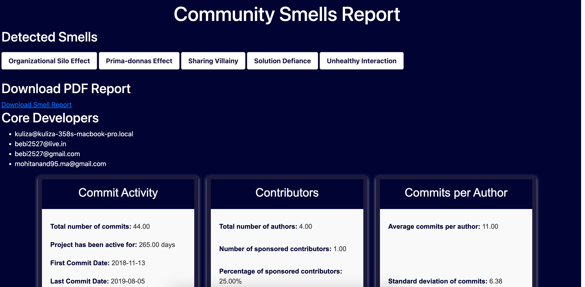
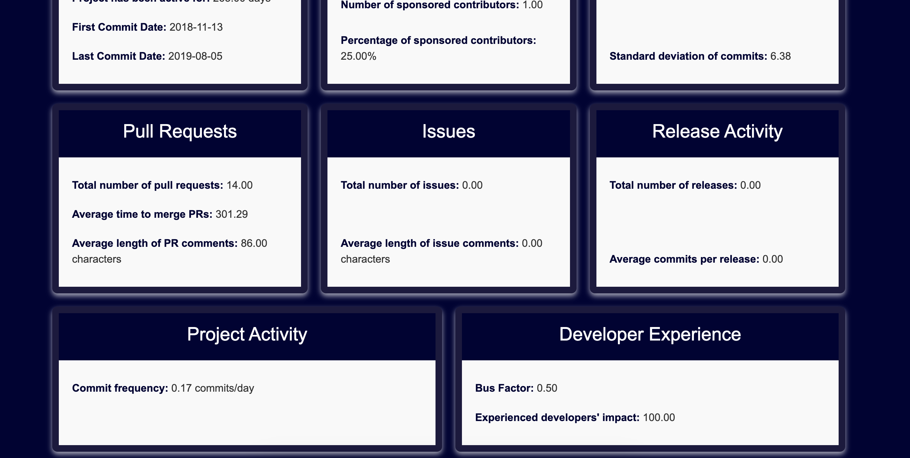
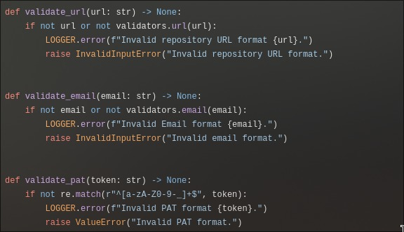
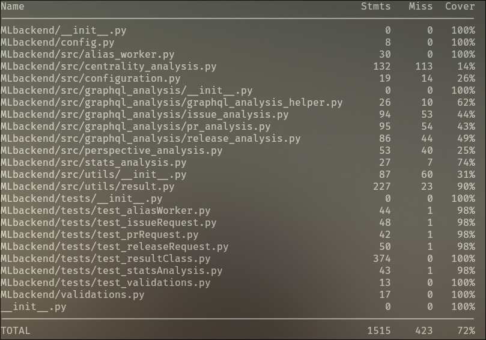

# course-project-g01


## Project Name
## Community Smell Detection Tool


## Overview

Community Smell Detection Tool is a web application solution designed to assist developers in automatically identifying "community smells" within their GitHub repositories. These smells represent patterns of ineffective collaboration, communication, or organizational practices within development teams that can negatively impact project productivity, quality, and timeline. By simply entering the URL of an GitHub repository, developers can analyze their projects for potential community smells and gain actionable insights to improve team dynamics and project outcomes.

This project is built upon and extends the existing [ **CSDetector** ](https://github.com/Nuri22/csDetector) tool, originally created by Nuri Almarimi and others [ **CSDetector Paper** ](https://mkaouer.net/publication/almarimi-2021-csdetector/almarimi-2021-csdetector.pdf). We have transformed the original command-line interface (CLI) tool into a more accessible and user-friendly web application. This web-based version enhances usability and ensures that the tool is available to a broader audience, including those who may not be comfortable with CLI environments.


**Key Features:**

* **Easy-to-use Web Interface:** A user-friendly web interface allows developers to input their GitHub repository URL and receive detailed analysis results with a copy of report as email.

* **Comprehensive Smell Detection:** The tool identifies a wide range of community smells, including:
    * Organizational Silo Effect
    * Black-cloud Effect
    * Prima-donnas Effect
    * Sharing Villainy
    * Organizational Skirmish
    * Solution Defiance
    * Radio Silence
    * Truck Factor Smell
    * Unhealthy Interaction
    * Toxic Communication

* **Actionable Insights:** Detailed reports provide clear explanations of detected smells and other key metrics detected.


**How it Works:**

1. **User-Friendly Interface**: A simple and intuitive interface for easy input of GitHub repository URL, PAT, and email address.

2. **Data Extraction:** The tool automatically extracts relevant data from the repository, including commit history, issue tracker, pull requests, and discussions.

3. **Smell Detection:** Advanced algorithms analyze the extracted data to identify potential community smells.

4. **Secure Authentication:**  Utilizes GitHub PAT for secure access to repository data.

5. **Report Generation:** The tool generates detailed reports highlighting the detected smells. It also automatically sends the PDF report to the specified email address.

**Limitations:**

1. **Data Accessibility**: The tool works with repositories that provide proper authentication via GitHub PAT.

2. **Smell Detection Scope:** The tool is currently limited to detecting the specified community smells and does not assess technical or code-related issues within the repository.

3. **GitHub Dependency:** The tool relies on GitHub's API and available data; therefore, any changes to GitHub's API or data structures could affect the tool’s functionality

## System Requirements and Pre-requisites

Before you begin, ensure your system meets the following requirements and that the necessary tools are installed:

**1. Operating System**
- Windows 10 or higher
- macOS 10.15 (Catalina) or higher
- Linux (Ubuntu 18.04+ or equivalent)

**2. Python**
- Python 3.8 or higher
  - Verify Python installation using:
    ```bash
    python --version
    ```
    or, for some systems:
    ```bash
    python3 --version
    ```

**3. Git**
- Git is required to clone the repository.
  - Verify Git installation using:
    ```bash
    git --version
    ```
  - Download Git from [https://git-scm.com/downloads](https://git-scm.com/downloads) if not already installed.

**4. Virtual Environment**
- A virtual environment is recommended to avoid dependency conflicts with system-level Python packages.

**5. Dependencies**
- All required Python dependencies are listed in the `requirements.txt` file and will be installed via pip.

**6. Ports and Network**
- Ensure port `3000` is available for the application to run.
- Allow network access to `localhost` or `0.0.0.0` if running on a server.

**7. GitHub Personal Access Token (PAT)**
- If the repository requires authentication, you will need a valid GitHub Personal Access Token (PAT) to clone it. 
- Follow [this guide](https://docs.github.com/en/authentication/keeping-your-account-and-data-secure/managing-your-personal-access-tokens#creating-a-fine-grained-personal-access-token) to create a fine-grained PAT.

**8. Repository URL**
-  The URL of project repository to be tested:

**9. Email Address**
- A valid email ID to receive the generated PDF report.

## Installation and Setup Guide

Follow the steps below to set up the project on your system.

**1. Install Python**

Ensure that Python is installed on your machine. You can download Python from the official website:  
[https://www.python.org/downloads/](https://www.python.org/downloads/)

**2. Clone the GitHub Repository**

Clone the repository to your local machine using the following command:

```
git clone https://github.com/CSCI5308/course-project-g01.git
```
**3. Create a Virtual Environment**

Creating a virtual environment is recommended to isolate the project dependencies from your system's Python installation.

* For Windows and Linux distributions other than Ubuntu/Debian, run:
```
python -m venv cs_venv
```
* For Ubuntu/Debian, use:
```
python3 -m venv cs_venv
```
This will create a virtual environment named cs_venv.

**4. Activate the Virtual Environment**

Activate the virtual environment to start working within it:

* For Bash, ZSH, or Windows shell:
```
source cs_venv/bin/activate
```
* For Fish shell:

```
source cs_venv/bin/activate.fish
```

Once activated, your terminal prompt should change, indicating that the virtual environment is active.

**5. Install Required Python Packages**

With the virtual environment activated, install the required dependencies using pip:

```
pip install -r requirements.txt
```
This will install all the necessary libraries for the project.

**6. Verify Virtual Environment is Active**

To ensure the virtual environment is activated correctly, you can run:
```
which python
```
This should return the path to the Python executable within the cs_venv directory.

**7. Update the `.env` File**

The project uses environment variables stored in a .env file. You must update this file with your secret keys and Gmail email credentials for SMTP setup.
- 1. Locate the .env file in the project directory (if it doesn't exist, create one).
- 2. Add the following entries:
```
SMTP_EMAIL=<your-gmail-address>
SMTP_PASSWORD=<your-gmail-app-password>
```
Replace <your-gmail-address>, and <your-gmail-app-password> with your actual values.


**8. Start the Application**

To start the application, use the following command:
```
python -m MLbackend.app
```
This will launch the application.

You can access it in your browser at http://localhost:3000

## Completed Features and Milestones

**1. Functional Web Application**

**2. GitHub Repository Analysis**

**3. Results Page and Visualization**

**4. PDF Report Generation**

**5. Email Notification System for Report**

## Planned Features and Future Enhancements

**1. Enhanced Smell Detection**

**2. Advanced Data Visualizations**

**3.Support for Additional Platforms**

## Work flow diagram


## User Scenarios

### 1. Homepage

- This is the initial view of the application, where users interact with the homepage to begin.

  

### 2. Form Validation Errors

-  When users submit the form with invalid or empty fields, validation errors are displayed to guide them on what needs to be corrected.

  

### 3. Form Filled Correctly

-  Once all input fields are filled correctly, the form is ready for submission.

  

### 4. Loading Screen

-  After submitting the form, a loading screen is displayed to indicate that the request is being processed.

  

### 5. Success/Results Screen

-  After the process is complete, the user is redirected to results page.

  

  

**Note: The web application is fully responsive and can be used seamlessly on any screen size, including desktops, tablets, and mobile devices.**

### Design Principles Followed

#### 1. **Single Responsibility Principle (SRP)**

Each module, class, or function in our code has a single responsibility. This means that each component of the application is designed to perform one specific task or function. By following this principle, we ensure that the system is easier to maintain, test, and extend.



#### 2. **Loosely Coupled Methods**

We aimed to design methods that are loosely coupled. This means that each method operates independently of others, with minimal dependencies. This leads to a more flexible and modular system where changes in one method are less likely to affect others.


#### 3. **Modularization**

Our codebase is modularized, meaning the application is broken down into smaller, manageable, and independent modules. Each module is responsible for a specific feature or functionality, making it easier to maintain, test, and extend the application.


#### 4. **No Hierarchy**

We avoided creating complex hierarchies in our application design. Instead, we kept the structure simple and flat, which prevents excessive complexity in navigating and understanding the codebase.


#### 5. **No Interfaces**

We avoided using interfaces in favor of more direct implementation methods. This decision ensures the code remains simple and flexible, with minimal boilerplate and overhead, allowing for faster development and easier modification.


### Test-Driven Development (TDD) and Unit Testing

In this project, we have applied **Test-Driven Development (TDD)** for the **Result class**, ensuring that its functionality is thoroughly tested before implementation. The TDD approach ensures that we catch issues early, create clean and maintainable code, and have a solid foundation for future refactoring.

In addition to TDD for the Result class, we have also written **unit tests** for other classes to verify the functionality of various components of the application. These unit tests help ensure that each class performs its intended function correctly and that changes or additions to the codebase do not break existing functionality.

---

### Test Coverage

The following image shows the **test coverage** for each class in the project. It provides a breakdown of which parts of the code are tested and how much of the codebase is covered by our tests.




*Screenshot of the test coverage for each class.*

As shown in the image, we strive to maintain high test coverage to ensure that our application remains robust and reliable. The coverage data helps us identify areas that require more tests and maintain the quality of the application.


**TDD commit hashes**

806b11bdebac2cf378ebc8a72e2716b9fe266a93

58063b83ff7b467e4733cebaae507b52fbaa54b9

1e3c0e187bd955bd89a693ef4399594a2071637f

f556695aff814638fbb5323b0351931483f669f9

152b52a768ab0e9f7c2da04816c6640d88c87375

573f75d95b112264a78cfd71f3cc774f26dde93d

f6f1ea50d0264895c33f9f911019554886b6e217

7941bc4722066c8ebba3858107033335fb9ca59b

4b82037f09f53e7975d58f1eb24f21e09c5df098

c35523a6c7c60c5a35bcf7886267da34b9519498

d5589354ec9e68a06e2db38e8b25ecee5ec1546d

8d0772801b544fe7df2e16ecd14b392b33a99a21

4b8fded37c273e3ac644d0829ff0877df697ae12

744ff378c85cfe56925413b05f3e6fe5b97f1504

1bed31a60d627fa069d0587e4076d8625248f652

5fbe0875364ff4e9f56429f8d50f014c1704449f

7381e076defa673a1f24a01ceae7fcd307adb11b

07dfebeafccc4e63492d0b582f10926b720cb7d0

03376f08099e8da329a6799ebf88ebaee2c48239

2307257693013d0a84a76ca5fd31a59fa6aab6e1


aa3f47d1c9ee76d7fc85c508c95b32c26a193e31

622a7874451e8ef5f818efc2956cdc24d1354789

52f5d9d3405bffa2ef912fcd07bf079810a4b3a2

81048242f99fea62dc0a16be286fb9f3a6190d6d

861747ee4802bda6b2aea5d1ab65a9a59a025371


fb79dbe84b473d365706ff297f66b7ceb7760675

1eb5cac6306baf5fa08c8fe124b6da0dfcd32fc4

2a28f8268771e020f1132f387fc6d69e95cd168e

dc91f15480e2c5059879bf3c9e43eb1e248caa47

eea7b8562d9343c4d6113c3f55cc7e596a2fd1ab

89675138cfd0920b4dbe49aba0ca335ce14c55c1

6c08c6aeeca41b01af46009b6ed6abb1e0c3cfcf

e6fa934c0febee6c46e45b700225ca9879421630

8aa690350ef4bb4ddebdd4980f23d207f00b8ad8

8aa690350ef4bb4ddebdd4980f23d207f00b8ad8

5f8198495129f5acda755614350f368f31aa14ec

44e7795ff7a662ec4d3d895c6930b707e4802603

9a16744b63fe1c4dcaa52d52efa3885ea0c33d6b

c2c1f55a58ac7b231167ad4236b76f14b0a103b9

cc306c1df575b573e57ce2dc50cd2013f8be2a92

f13840a6da5338170732cc81befe13e53f199e2a

725fa0966ceab0791b83fbabfbd7f48d151ff229

e4efae038e023b1a92d04ce739b41130f2fb5b96

832514ec4c9222200f060989d9e6c14a60e3231c

0105c26d2ba48d33b0a1bdf49124417d075a60dc

42a92cfd0758ad9914aa8ebcc6a18709a40157af

6e93b4e911105034cb66a43ff285dee7bb8c1585

8e988e2ce7ee8faf051afd5a14cb9d2205debd1b

70eea8690e0516177cf88575ea7dd80f021775cc

66091eaac8895711b9c9fc1317ee6e3bec249c7f

df428852d94c57195741f00931ee66fae0c08bc6

f55f48d36c8be5814284766f8e40937b68a7dc92

b079559981aec629a8d3f459c4f4e2e1ce8bfce3

11e034b9fb24e6ea9ae49c27dc5f6b2b8f304e56

219c240f42d621db4ea662048790f9a2a81f8a7a

f27b3b3da2f6abe6f48187912a05301b1984683d

7495da86c936eb8eb409ef52273a03a816b91bf6

901e13aa4ea1850a4da5d9b8305a23e268c38d1b


ef7f10458e4b13c54ebdb7be4cccccf96ee4fde7

6ed3ca297f431060dbe9894f175737e862e04142

0fd634a173f51f17e85190f3d05e06d5fda87ec7

5c1b3703b0d05fa00e6bbac332dfea21d7f157bb

cff44f53d7a6f55955621d9778987a28c43985d5

a4b3145de00370f897ad451ccecabbf25f2559c8

50d09bc4b3b28842948235d8366b268c1064af65

7645c99ec3d5133d7342af427240b1c8d54ec126

b96f9d99fbf467e9c3ed8d29d71f26c84b04e3e9

d5ac81476463720b02c508b61dfeabd03145167d

0094727f0f4174039c40c68dce1e8954934f6b6e

55c52c5ddbef110a139d2a512105b0ffc3181a17

37af974be7bb74cc05db6ecf10f7a25d101a3646

a197f200ae53be7bdc2568bcedff8c79d47f3dc1

4de1767c9f7ec053cf467eb1bd1eb11bbe2b5b2b

d64e3fa2c92b6673da4a841727557a94156bb805

900de323681c71f9ec9919437ec66fc57b406011

a493e42cd96fb79de958afd0606cc53ecd998b6a

ee276a47237a5745015316f9a24aa4a0401168f7

37788ba2bfbb01dbc8cb865c97488dce5eb926c5

2bad7308a9320570233dc062c3648f10176e0b23

0c00c33e00b53ebab583b196275586c9ae9d6c4b

ba8089afb6963ea50f0bae4808e674d711a085bf

16297b356d34c415989c67e13d1dcd2d0b4efc47

5f17831fec8f71e502dbc462df7d7dc87c5be3cc

b6b60ace8853a2cfd26a800d23a48f4433da3247

6e858dfb108a450eed21457d9505fbb2623efd4as

fa39614bf0af97b9f7b58dff96ac6d66b223fe18

a66a3c866c60184243060db0b5cea9fa7011aeac

## Folder Structure

- **frontend/**: This directory contains all the code related to the client-side of the application, including user interface components, styling, and client-side logic

- **backend/**: This directory contains the server-side code, including the application logic, GitHub API integrations, and API endpoints that handle requests from the frontend.


## Branches

- **main**: This branch holds the stable, production-ready version of the code, which is deployed in the live environment.

- **development**: This branch is dedicated to ongoing development work, where new features, bug fixes, and improvements are implemented before being merged into the main branch.
